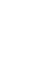
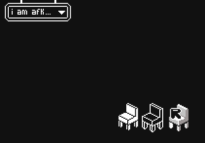

# digi-ttf

[](https://aur.archlinux.org/packages/digi-ttf)

##  a lowercase pixel font .
  <p align="center">
   
   
  </p>
 


## installation .
arch .
  ```bash
  yay -S digi-tff
  ```

otherwise (and move .ttf into appropriate folder) .
  ```bash
  curl -O https://raw.githubusercontent.com/danapixels/digi-ttf/main/digi.ttf
  ```
